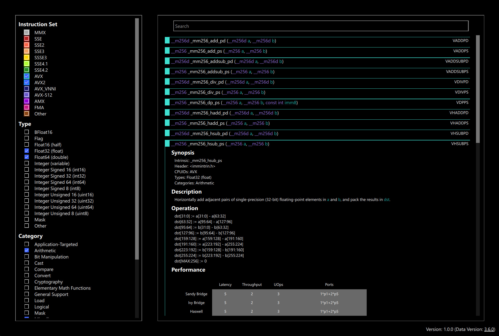

## ShiftIntrinsicGuide

ShiftIntrinsicGuide is a GUI for x86 intrinsic instruction information. It proveds a searchable list of all currently available intrinsic instructions and combines it with real-world latency/throughput measurements from a variety of different hardware architectures (Intel and AMD).

It combines data from the following sources:

- Intrinsic data from [Intel Intrinsics Guide](https://www.intel.com/content/www/us/en/docs/intrinsics-guide/index.html).
- Performance data from [uops.info](https://www.uops.info).

## Screenshot

## Features

- Searchable list of all available x86 intrinsic instructions.
- Instructions searchable by:
    - Intrinsic name
    - Assembly instruction
    - Required x86 technology level (e.g. SSE3, AVX etc.)
    - Types operated on (e.g. float, 8-bit integers etc.)
    - Instruction category (e.g. arithmetic, load etc.)
- Displays information for each intrinsic such as:
    - Intrinsic form
    - Assembly instruction
    - Required include header
    - Required CPUID support
    - Instruction description
    - Instruction operation pseudo code
- Displays performance measurements such as:
    - Latency
    - Throughput
    - uops
    - Port usage
- Offline use: Data is directly retrieved from the online sources on first run and cached for future use.
- Periodic data update checks (as well as manual)

## Downloads

Pre-built executables are available from the [releases](https://github.com/ShiftIntrinsicGuide/releases) page in a single archive.
